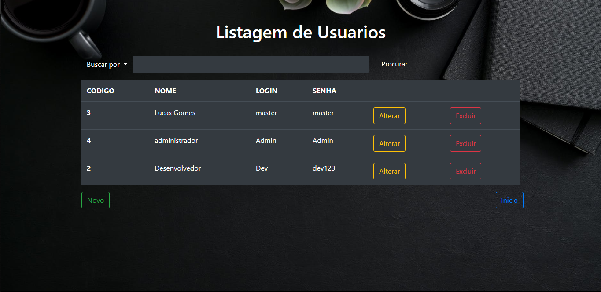
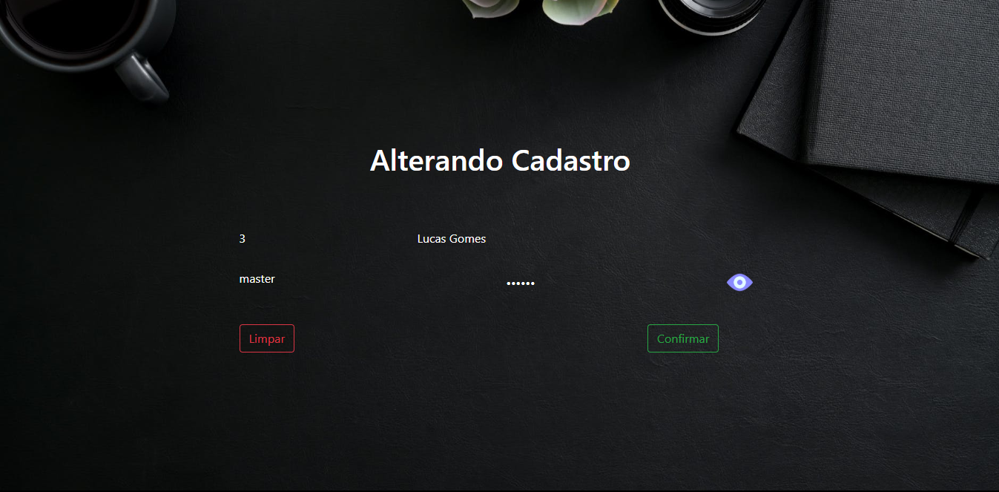

# JSP-CRUD-JAVAWEB Com DarkMode

##### Descrição
###### Aproveitando os exemplos de projetos que fizemos em sala e o material sobre banco de dados, crie um projeto java web que permita o CRUD de usuários, ou seja, inclusão, alteração, exclusão, consulta e pesquisa em banco de dados.
## tela inicial
- [x] Apresentação
- [x] dark mode padrão

## Listagem de Usuarios
- [x] Listar Usuarios do Banco
- [ ] Permitir Busca filtrada
- [x] Permitir Cadastrar novo
- [x] Permitir Excluir Usuario
- [x] Permitir Alterar Usuario

## Cadastro de Usuarios
- [x] Cadastrar No Banco
- [x] Validações frontend
- [x] Validações backend
- [x] Limpar tela

## Alterar cadastro de Usuarios
- [x] Alterar No Banco
- [x] Validações frontend
- [x] Validações backend
- [x] Limpar tela 

## REQUIRED

- [x] Tomcat
- [x] Postgres v10
- [x] IDE 
- [x] Navegador
- [x] Internet para import do bootstrap

#### Backup do Banco esta na pasta Banco/
